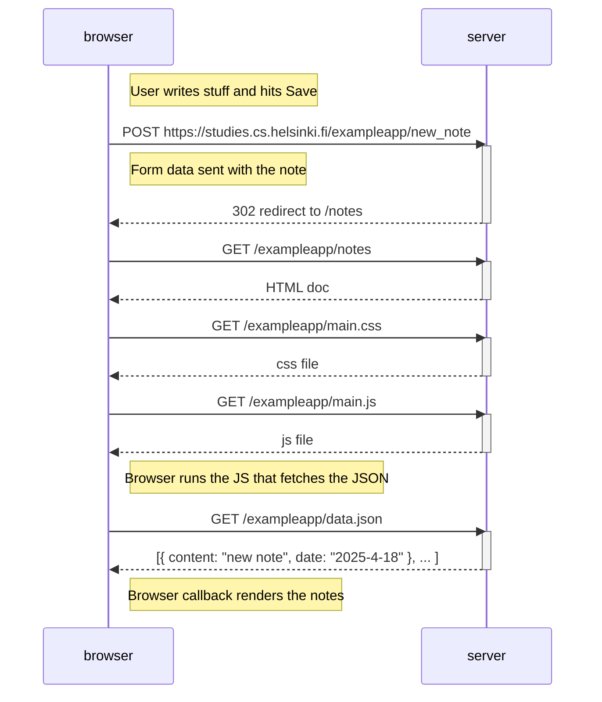

# New Note Diagram

```mermaid
sequenceDiagram
    participant browser
    participant server
    
    Note right of browser: User writes stuff and hits Save
    
    browser->>server: POST https://studies.cs.helsinki.fi/exampleapp/new_note
    activate server
    Note right of browser: Form data sent with the note
    server-->>browser: 302 redirect to /notes
    deactivate server
    
    browser->>server: GET /exampleapp/notes
    activate server
    server-->>browser: HTML doc
    deactivate server
    
    browser->>server: GET /exampleapp/main.css
    activate server
    server-->>browser: css file
    deactivate server
    
    browser->>server: GET /exampleapp/main.js
    activate server
    server-->>browser: js file
    deactivate server
    
    Note right of browser: Browser runs the JS that fetches the JSON
    
    browser->>server: GET /exampleapp/data.json
    activate server
    server-->>browser: [{ content: "new note", date: "2025-4-18" }, ... ]
    deactivate server
    
    Note right of browser: Browser callback renders the notes
```