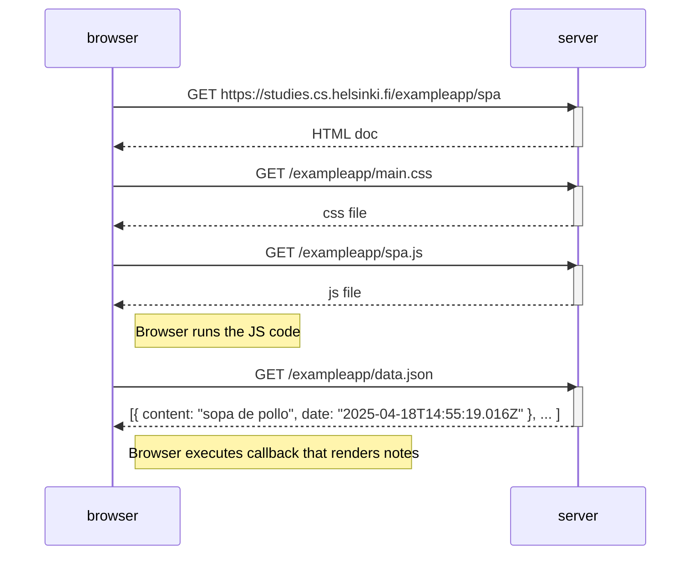

# Single Page App Diagram

```mermaid
sequenceDiagram
    participant browser
    participant server
    
    browser->>server: GET https://studies.cs.helsinki.fi/exampleapp/spa
    activate server
    server-->>browser: HTML doc
    deactivate server
    
    browser->>server: GET /exampleapp/main.css
    activate server
    server-->>browser: css file
    deactivate server
    
    browser->>server: GET /exampleapp/spa.js
    activate server
    server-->>browser: js file
    deactivate server
    
    Note right of browser: Browser runs the JS code
    
    browser->>server: GET /exampleapp/data.json
    activate server
    server-->>browser: [{ content: "sopa de pollo", date: "2025-04-18T14:55:19.016Z" }, ... ]
    deactivate server
    
    Note right of browser: Browser executes callback that renders notes
```